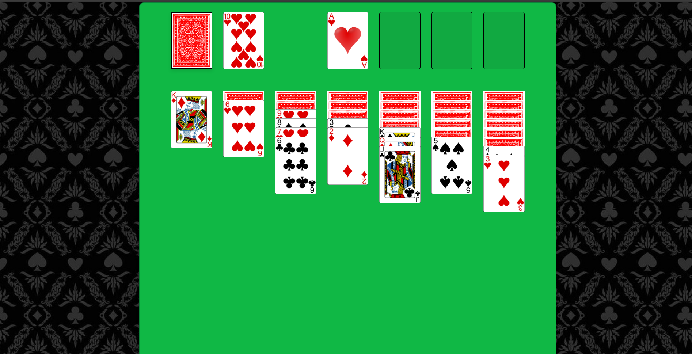

# Solitaire

Here's my attempt at recreating the popular signle player cardgame Solitaire.

Screens: 

### TODOs: 

1. Need to create proper scenarios. 
2. Need to fix some minor bugs regarding drag and drop.
3. Need to implement game finish. 

## How to run

In the project directory, you can run:

### `npm start`

Runs the app in the development mode.\
Open [http://localhost:3000](http://localhost:3000) to view it in the browser.

### `npm run server`

Launches the dummy backend. 

